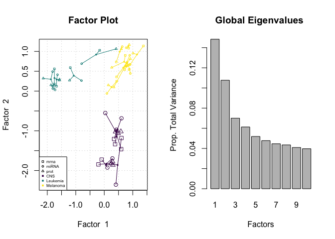

<!-- README.md is generated from README.Rmd. Please edit that file -->

# nipalsMCIA: Software to Compute Multi-Block Dimensionality Reduction

<!-- badges: start -->
<!-- badges: end -->

This package computes Multiple Co-Inertia Analysis (MCIA) on multi-block
data using the Nonlinear Iterative Partial Least Squares (NIPALS)
method.

Features include:

- Efficient computation of deflation and variance enabling embedding of
  high-volume (e.g. single-cell) datasets.  
- Functionality to perform out-of-sample embedding.
- Easy-to-adjust options for deflation and pre-processing.
- Multiple visualization and analysis options for sample- and
  feature-level embedding results.
- Streamlined and well-documented and supported code that is consistent
  with published theory to enable more efficient algorithm development
  and extension.
**References**

Mattessich (2022) A Review of Multi-Block Dimensionality Reduction via
Multiple Co-Inertia Analysis, M.S. Thesis, Dept. of Mathematics, Tufts
University (<http://hdl.handle.net/10427/CZ30Q6773>)

Hanafi et al. (2011) Connections between multiple co-inertia analysis
and consensus principal component analysis, Chemometrics and Intelligent
Laboratory Systems 106 (1)
(<https://doi.org/10.1016/j.chemolab.2010.05.010>.)

Meng et al. (2014) A multivariate approach to the integration of
multi-omics datasets, BMC Bioinformatics 2014(15)
(<https://doi.org/10.1186/1471-2105-15-162>)

## Installation

To install the current development version from Bioconductor, use 
``` r
if (!require("BiocManager", quietly = TRUE))
    install.packages("BiocManager")

BiocManager::install(version='devel')

BiocManager::install("nipalsMCIA")
```

nipalsMCIA can also be installed from [GitHub](https://github.com/) 
provided the [devtools](https://www.r-project.org/nosvn/pandoc/devtools.html) package is also installed:

``` r
devtools::install_github("Muunraker/nipalsMCIA",
                           build_vignettes = TRUE)
```

## Basic Example

The package currently includes one test dataset: `data_blocks`. This is
a list of dataframes containing observations of variables from three
omics types (mRNA, proteins, and micro RNA) on 21 cancer cell lines from
the NCI60 cancer cell lines. The data file includes a `metadata` data
frame containing the cancer type associated with each cell line.

``` r
# load the package and set a seed for reproducibility
library(nipalsMCIA)
set.seed(42)
```

``` r
data(NCI60) # import data as "data_blocks" and metadata as "metadata_NCI60"

# examine the data and metadata
summary(data_blocks)
#>       Length Class      Mode
#> mrna  12895  data.frame list
#> miRNA   537  data.frame list
#> prot   7016  data.frame list
head(metadata_NCI60)
#>            cancerType
#> CNS.SF_268        CNS
#> CNS.SF_295        CNS
#> CNS.SF_539        CNS
#> CNS.SNB_19        CNS
#> CNS.SNB_75        CNS
#> CNS.U251          CNS
table(metadata_NCI60)
#> metadata_NCI60
#>      CNS Leukemia Melanoma 
#>        6        6        9
```
*Note: this dataset is reproduced from the [omicade4 package](https://www.bioconductor.org/packages/release/bioc/html/omicade4.html)
(Meng et. al., 2014). 

nipalsMCIA requires all input data to be formatted as a [MultiAssayExperiment](https://bioconductor.org/packages/release/bioc/html/MultiAssayExperiment.html). 
The package provides a simple function to convert a list of dataframes and accompanying metadata to a MAE object:
``` r
data_blocks_mae <- simple_mae(data_blocks,row_format="sample",
                                  colData=metadata_NCI60)
```
Note: the `row_format` argument specifies whether the dataset rows correspond to samples or features.

The main MCIA function can be called on `data_blocks_mae`: 
``` r
mcia_results <- nipals_multiblock(data_blocks_mae, num_PCs = 10,
                                  tol = 1e-12, max_iter = 1000,
                                  col_preproc_method = "colprofile",
                                  color_col = "cancerType",
                                  deflationMethod = "block")
```
The output is an object of the `NipalsResult` class, which contains the low-dimensional representation of the data (with dimension set by `num_PCs`) as well as other information about the decomposition. By default, the function plots the first two scores vectors colored by the `color_col = "cancerType"` field in `metadata_NCI60`. It also generates a scree plot of the global eigenvalues.


