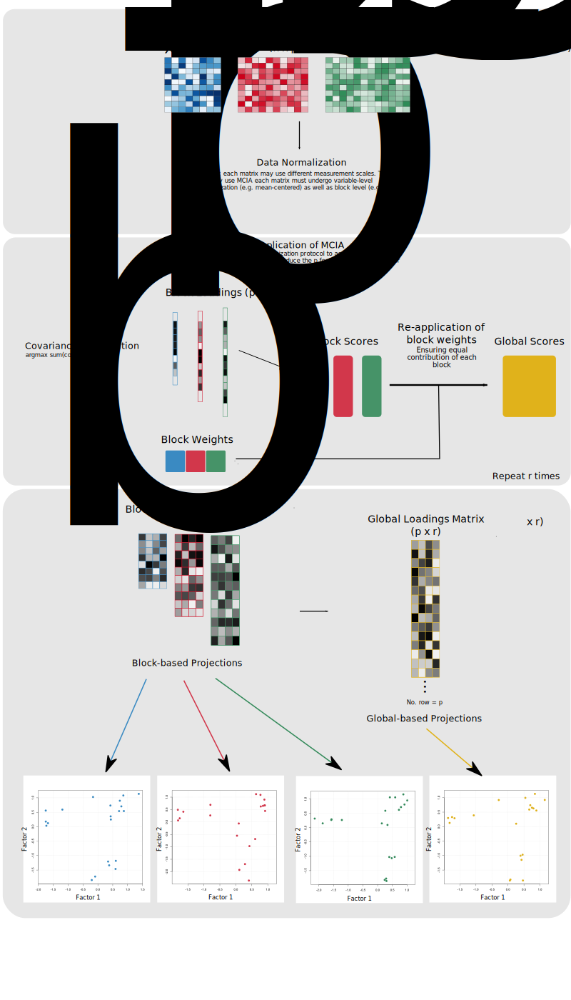

```{r setup-ml-pipeline, include = FALSE}
knitr::opts_chunk$set(echo = TRUE)
```

## Introduction

The Mini-Lecture, Brief outline of the math behind MCIA, covered the
mathematical aspects of MCIA. This second Mini-Lecture will cover the full
MCIA pipeline, with a focus on the standard preprocessing of multi-block data
and post-processing following MCIA. The target audience of this Mini-Lecture
are bioinformaticians or any other general practitioners.

```{r, echo = FALSE, out.width = "100%", out.length = "80%", fig.align = "center"}

```


## Session Info 

```{r session-info, echo = FALSE} 
sessionInfo()
```
