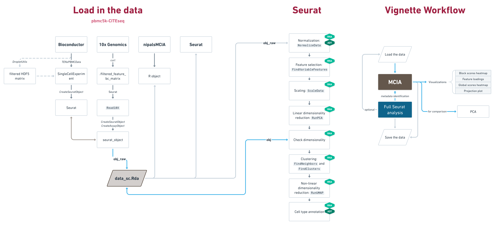

```{r setup, include = FALSE}
knitr::opts_chunk$set(echo = TRUE) # out.width = "100%"
set.seed(42) # NIPALS starts with a random vector
```

## Introduction

In this vignette, we will cover some of the possible sources for single-cell 
data, how to format it for and process it with MCIA and how to run a basic 
analysis in order to annotate the data and use the results as metadata for 
exploring the decomposition results.


I'll check the new method, the top features and the filtering steps. I'll also get the bunch of intermediate objects I was generating cleaned up/standardized and do another pass at making the cell type annotations more accurate.

**This diagram will be updated.**

```{r, echo = FALSE}

```

```{r load-packages, echo = TRUE, include = FALSE}
# note that the TENxPBMCData package is not included in this list as you may 
# decide to pull data from another source or use our provided objects

library(dplyr)
library(ggplot2)
library(nipalsMCIA)
library(piggyback)
library(Seurat)

# maybe remove this one
library(tidyverse)
```

## Data

We will be using the 10x Genomics "pbmc5k-CITEseq" dataset, which was published in May 2019 and processed using Cell Ranger 3.0.2. It contains 5, 247 detected cells from PBMCs and 33, 538 genes along with 32 cell surface markers. We chose this dataset due to it containing both gene expression (GEX) and cell surface protein (ADT) data as well as being relatively recent, publicly available and from a widely used platform.

The following code details several ways in which to load in this dataset. You may prefer to use data from other sources outside of 10x Genomics, in which case you will have to format it to work with nipalsMCIA.

### All Sources

We have made the objects described below available in one data file which you can load here if you do not want to run the following sections. **This file includes the processed object that you will need in order to run MCIA.**

*Currently combining all of the files into one is under development*.

```{r}
# list all of the currently available data in v0.0.1
pb_list(repo = "Muunraker/nipalsMCIA", tag = "v0.0.1")
```

```{r, echo = FALSE, eval = FALSE}
# test this!
# load("data_sc.Rdata")

# download the sc data
pb_download(file = "data_blocks_sc.Rda", repo = "Muunraker/nipalsMCIA", 
            tag = "v0.0.1", dest = file.path("..", "inst", "extdata"))
pb_download(file = "data_blocks_sc_seurat.Rds", repo = "Muunraker/nipalsMCIA", 
            tag = "v0.0.1", dest = file.path("..", "inst", "extdata"))
```

```{r}
# test out what this fully is
load(file = file.path("..", "inst", "extdata", "data_blocks_sc.Rda"))
data_blocks_sc_seurat <- readRDS(file = file.path("..", "inst", "extdata", "data_blocks_sc_seurat.Rds"))
```

### Bioconductor

There are several Bioconductor packages which provide single-cell data for users 
as part of the package. The [TENxPBMCData](https://bioconductor.org/packages/3.15/data/experiment/html/TENxPBMCData.html) contains 9 different publicly available datasets from 10x Genomics (stored as [SingleCellExperiment](https://bioconductor.org/packages/release/bioc/html/SingleCellExperiment.html) classes), including the one that we will be analyzing.

Note that the CITE-Seq information is being stored as an "[alternative experiment](https://bioconductor.org/books/3.16/OSCA.intro/the-singlecellexperiment-class.html#alternative-experiments)" within the SingleCellExperiment object. Both the GEX (`"mainExpName: Gene Expression"`) and ADT (`"altExpNames(1): Antibody Capture"`) data were stored in the DelayedMatrix format since they are so large. In this object, the rows represent the features and the columns represent the cells.

```{r, eval = FALSE}
# read in the data as a SingleCellExperiment object
tenx_pbmc3k <- TENxPBMCData::TENxPBMCData(dataset = "pbmc5k-CITEseq")

# examine the data:
counts(tenx_pbmc3k) 
# <33538 x 5247> sparse matrix of class DelayedMatrix and type "integer":
#                    [, 1]    [, 2]    [, 3]    [, 4] ... [, 5244] [, 5245] [, 5246] [, 5247]
# ENSG00000243485       0       0       0       0   .       0       0       0       0
# ENSG00000237613       0       0       0       0   .       0       0       0       0
# ENSG00000186092       0       0       0       0   .       0       0       0       0
# ENSG00000238009       0       0       0       0   .       0       0       0       0
# ENSG00000239945       0       0       0       0   .       0       0       0       0
#             ...       .       .       .       .   .       .       .       .       .
# ENSG00000277856       0       0       0       0   .       0       0       0       0
# ENSG00000275063       0       0       0       0   .       0       0       0       0
# ENSG00000271254       0       0       0       0   .       0       0       0       0
# ENSG00000277475       0       0       0       0   .       0       0       0       0
# ENSG00000268674       0       0       0       0   .       0       0       0       0

counts(altExp(tenx_pbmc3k)) 
# <32 x 5247> sparse matrix of class DelayedMatrix and type "integer":
#           [, 1]    [, 2]    [, 3]    [, 4] ... [, 5244] [, 5245] [, 5246] [, 5247]
#    CD3      25     959     942     802   .     402     401       6    1773
#    CD4     164     720    1647    1666   .    1417       1      46    1903
#   CD8a      16       8      21       5   .       8     222       3       9
#  CD11b    3011      12      11      11   .      15       7    1027       9
#   CD14     696      12      13       9   .       9      17     382       8
#    ...       .       .       .       .   .       .       .       .       .
# HLA-DR     573      15      11      19   .       6      40     184      32
#  TIGIT      10       3       3       3   .       2      15       1      12
#   IgG1       4       4       2       4   .       1       0       2       4
#  IgG2a       1       3       0       6   .       4       0       4       2
#  IgG2b       6       2       4       8   .       0       0       2       5

# examine the metadata:
head(colData(tenx_pbmc3k))
# DataFrame with 6 rows and 11 columns
#           Sample            Barcode         Sequence   Library Cell_ranger_version Tissue_status Barcode_type
#      <character>        <character>      <character> <integer>         <character>   <character>  <character>
# 1 pbmc5k-CITEseq AAACCCAAGAGACAAG-1 AAACCCAAGAGACAAG         1              v3.0.2            NA     Chromium
# 2 pbmc5k-CITEseq AAACCCAAGGCCTAGA-1 AAACCCAAGGCCTAGA         1              v3.0.2            NA     Chromium
# 3 pbmc5k-CITEseq AAACCCAGTCGTGCCA-1 AAACCCAGTCGTGCCA         1              v3.0.2            NA     Chromium
# 4 pbmc5k-CITEseq AAACCCATCGTGCATA-1 AAACCCATCGTGCATA         1              v3.0.2            NA     Chromium
# 5 pbmc5k-CITEseq AAACGAAAGACAAGCC-1 AAACGAAAGACAAGCC         1              v3.0.2            NA     Chromium
# 6 pbmc5k-CITEseq AAACGAAAGAGTGACC-1 AAACGAAAGAGTGACC         1              v3.0.2            NA     Chromium
#     Chemistry Sequence_platform   Individual Date_published
#   <character>       <character>  <character>    <character>
# 1 Chromium_v3           NovaSeq HealthyDonor     2019-05-29
# 2 Chromium_v3           NovaSeq HealthyDonor     2019-05-29
# 3 Chromium_v3           NovaSeq HealthyDonor     2019-05-29
# 4 Chromium_v3           NovaSeq HealthyDonor     2019-05-29
# 5 Chromium_v3           NovaSeq HealthyDonor     2019-05-29
# 6 Chromium_v3           NovaSeq HealthyDonor     2019-05-29

metadata(tenx_pbmc3k)
# list()
```

In order to run MCIA, the format of this data must be slightly modified:

```{r, eval = FALSE}
# set up the list
data_blocks_sc_sce <- list()
data_blocks_sc_sce$mrna <- data.frame(as.matrix(counts(tenx_pbmc3k)))
data_blocks_sc_sce$adt <- data.frame(as.matrix(counts(altExp(tenx_pbmc3k))))

summary(data_blocks_sc_sce)

# convert to Seurat
obj <- CreateSeuratObject(counts = data_blocks_sc_sce$mrna, 
                          # meta.data = as.data.frame(SingleCellExperiment::rowData(tenx_pbmc3k), 
                          #             row.names = rownames(data_blocks_sc_sce$mrna)), 
                          row.names = rownames(data_blocks_sc_sce$mrna)) # default assay (RNA)
obj[["ADT"]] <- CreateAssayObject(counts = data_blocks_sc_sce$adt)

# alternate approach
# pbmc.data <- as(counts(tenx_pbmc3k), "Matrix")
# colnames(pbmc.data) <- paste0("Cell", seq_len(ncol(pbmc.data)))
# rownames(pbmc.data) <- make.unique(rowData(tenx_pbmc3k)[, "Symbol_TENx", drop = TRUE])
# rownames(pbmc.data) <- scater::uniquifyFeatureNames(rowData(tenx_pbmc3k)$ENSEMBL_ID, 
#                                                     rowData(tenx_pbmc3k)$Symbol_TENx)
# pbmc <- CreateSeuratObject(counts = pbmc.data)

# add metadata
# rownames(obj[[]]) <- rownames(obj@assays$RNA@counts)
obj <- AddMetaData(obj, as.data.frame(SingleCellExperiment::rowData(tenx_pbmc3k), 
                                      row.names = rownames(obj)))

head(obj[[]])
#      orig.ident nCount_RNA nFeature_RNA nCount_ADT nFeature_ADT
# X1 SeuratProject       7375         2363       5178           31
# X2 SeuratProject       3772         1259       2893           29
# X3 SeuratProject       4902         1578       3635           29
# X4 SeuratProject       6704         1908       3700           31
# X5 SeuratProject       3900         1589       3423           28
# X6 SeuratProject      11781         3136       4665           30
```

```{r, eval = FALSE}
# save the data
data_blocks_sc_sce_seurat <- obj
save(data_blocks_sc_sce, data_blocks_sc_sce_seurat, 
     file = file.path("..", "data", "data_sc_sce.Rdata"))

# upload to piggyback
pb_upload(file = "data/data_sc_sce.Rdata", repo = "Muunraker/nipalsMCIA", tag = "v0.0.1")
```


```{r, message = FALSE, include = FALSE, eval = FALSE}
# Possible alternate dataset as described in a [SingleCellMultiModal](https://www.bioconductor.org/packages/release/data/experiment/vignettes/SingleCellMultiModal/inst/doc/CITEseq.html#3_CITE-seq_dataset) vignette.
                                                                    
# library(MultiAssayExperiment)
# library(SingleCellMultiModal) # might need `sudo apt install libmagick++-dev`

mae <- SingleCellMultiModal::CITEseq(DataType = "cord_blood", modes = "*", 
                                     dry.run = FALSE, version = "1.0.0")
mae
experiments(mae)
sampleMap(mae)

sce <- CITEseq(DataType = "cord_blood", modes = "*", dry.run = FALSE, 
               version = "1.0.0", DataClass = "SingleCellExperiment")
sce

# https://support.bioconductor.org/p/9136786/
# colnames(sce) <- sce$Barcodes
# colnames(sce) <- make.unique(colnames(sce))
# seurat <- as.Seurat(sce, counts = "counts", data = NULL)
# seurat
```

### 10x Genomics and Seurat

The original dataset can be found on the [10x Genomics Datasets website](https://support.10xgenomics.com/single-cell-gene-expression/datasets/3.0.2/5k_pbmc_protein_v3) and an explanation of the file types for this version can be found [here](https://support.10xgenomics.com/single-cell-gene-expression/software/pipelines/3.0/output/overview). You can download them all to a directory of your choosing with their suggested terminal commands:

```{bash, eval = FALSE}
# Input Files
curl -O https://cf.10xgenomics.com/samples/cell-exp/3.0.2/5k_pbmc_protein_v3/5k_pbmc_protein_v3_fastqs.tar
curl -O https://cf.10xgenomics.com/samples/cell-exp/3.0.2/5k_pbmc_protein_v3/5k_pbmc_protein_v3_feature_ref.csv

# Output Files
curl -O https://cf.10xgenomics.com/samples/cell-exp/3.0.2/5k_pbmc_protein_v3/5k_pbmc_protein_v3_possorted_genome_bam.bam
curl -O https://cf.10xgenomics.com/samples/cell-exp/3.0.2/5k_pbmc_protein_v3/5k_pbmc_protein_v3_possorted_genome_bam.bam.bai
curl -O https://cf.10xgenomics.com/samples/cell-exp/3.0.2/5k_pbmc_protein_v3/5k_pbmc_protein_v3_molecule_info.h5
curl -O https://cf.10xgenomics.com/samples/cell-exp/3.0.2/5k_pbmc_protein_v3/5k_pbmc_protein_v3_filtered_feature_bc_matrix.h5
curl -O https://cf.10xgenomics.com/samples/cell-exp/3.0.2/5k_pbmc_protein_v3/5k_pbmc_protein_v3_filtered_feature_bc_matrix.tar.gz
curl -O https://cf.10xgenomics.com/samples/cell-exp/3.0.2/5k_pbmc_protein_v3/5k_pbmc_protein_v3_raw_feature_bc_matrix.h5
curl -O https://cf.10xgenomics.com/samples/cell-exp/3.0.2/5k_pbmc_protein_v3/5k_pbmc_protein_v3_raw_feature_bc_matrix.tar.gz
curl -O https://cf.10xgenomics.com/samples/cell-exp/3.0.2/5k_pbmc_protein_v3/5k_pbmc_protein_v3_analysis.tar.gz
curl -O https://cf.10xgenomics.com/samples/cell-exp/3.0.2/5k_pbmc_protein_v3/5k_pbmc_protein_v3_metrics_summary.csv
curl -O https://cf.10xgenomics.com/samples/cell-exp/3.0.2/5k_pbmc_protein_v3/5k_pbmc_protein_v3_web_summary.html
curl -O https://cf.10xgenomics.com/samples/cell-exp/3.0.2/5k_pbmc_protein_v3/5k_pbmc_protein_v3_cloupe.cloupe
```

If you would like to view some basic information about the data, you can open the *web_summary.html* in your favorite web browser. It will show the estimated number of cells, mean reads per cell, median genes per cell and a variety of other sample metrics. These metrics are also available in the *metrics_summary.csv* file.

You will need the *filtered_feature_bc_matrix* directory for the following analysis; it can be extracted with `tar -xvzf 5k_pbmc_protein_v3_filtered_feature_bc_matrix.tar.gz` from within the relevant data directory.

```{r, eval = FALSE}
# load the data (change the file path as needed)
data <- Seurat::Read10X(file.path("..", "data", "tenx_pbmc5k_CITEseq", 
                                  "filtered_feature_bc_matrix"),
                        strip.suffix = TRUE) # remove the "-1"s from barcodes
# 10X data contains more than one type and is being returned as a list containing matrices of each type.

# set minimum cells and/or features here if you'd like
obj <- Seurat::CreateSeuratObject(counts = data$`Gene Expression`,
                                  project = "pbmc5k_CITEseq")
obj[['ADT']] <- Seurat::CreateAssayObject(counts = data$`Antibody Capture`)
# Warning: Feature names cannot have underscores ('_'), replacing with dashes ('-')

# check the assays
Seurat::Assays(obj)
# "RNA" "ADT"

# list out the CITE-Seq markers
rownames(obj[["ADT"]])
#  [1] "CD3-TotalSeqB"           "CD4-TotalSeqB"           "CD8a-TotalSeqB"          "CD11b-TotalSeqB"        
#  [5] "CD14-TotalSeqB"          "CD15-TotalSeqB"          "CD16-TotalSeqB"          "CD19-TotalSeqB"         
#  [9] "CD20-TotalSeqB"          "CD25-TotalSeqB"          "CD27-TotalSeqB"          "CD28-TotalSeqB"         
# [13] "CD34-TotalSeqB"          "CD45RA-TotalSeqB"        "CD45RO-TotalSeqB"        "CD56-TotalSeqB"         
# [17] "CD62L-TotalSeqB"         "CD69-TotalSeqB"          "CD80-TotalSeqB"          "CD86-TotalSeqB"         
# [21] "CD127-TotalSeqB"         "CD137-TotalSeqB"         "CD197-TotalSeqB"         "CD274-TotalSeqB"        
# [25] "CD278-TotalSeqB"         "CD335-TotalSeqB"         "PD-1-TotalSeqB"          "HLA-DR-TotalSeqB"       
# [29] "TIGIT-TotalSeqB"         "IgG1-control-TotalSeqB"  "IgG2a-control-TotalSeqB" "IgG2b-control-TotalSeqB"

# save the object
saveRDS(obj, file.path("..", "data", "tenx_pbmc5k_CITEseq_raw.rds"))

# upload to piggyback
pb_upload(file = file.path("..", "data", "tenx_pbmc5k_CITEseq_raw.rds"), 
          repo = "Muunraker/nipalsMCIA", tag = "v0.0.1")
```

You can also load the Seurat object directly, such as in the "Read in and process the data" in the "Seurat analysis" section later in the vignette.

## MCIA

### Metadata

Note that the "-1"s have been removed from the cell barcodes.

```{r}
# metadata_sc <- tibble::column_to_rownames(obj_annotations, var = "Cluster")

# TO DO: Change the metadata to be independent of loading in a processed Seurat object
# TO DO: Change this to pull from piggyback instead

obj <- readRDS(file = file.path("..", "data", "tenx_pbmc5k_CITEseq_annotated.rds"))
metadata_sc <- data.frame(obj$annotated_clusters) %>%
                dplyr::rename(CellType = "obj.annotated_clusters") %>%
                arrange(CellType)
metadata_sc$CellType <- as.character(metadata_sc$CellType)

# example
metadata_sc %>% sample_n(10)
```

### Running the decomposition

```{r, eval = FALSE}
# old

# don't transpose??
mcia_results_sc <- nipals_multiblock(data_blocks_sc, 
                                     preproc_method = "colprofile", 
                                     num_PCs = 10, tol = 1e-9, 
                                     metadata = metadata_sc, plots = "none")

# TO DO: Alphabetize these
mcia_results_sc$metadata <- metadata_sc

saveRDS(mcia_results_sc, file = file.path("..", "data", "mcia_results_sc.Rds"))
``` 

```{r, eval = FALSE}
# updated with Seurat

# with transposition this works
mcia_results_sc <- nipals_multiblock(data_blocks_sc_seurat, 
                                     preproc_method = "colprofile", 
                                     num_PCs = 10, tol = 1e-9, 
                                     metadata = metadata_sc, plots = "none")
# Performing centered column profile pre-processing...
# Pre-processing completed.
# Computing order 1 scores
# Computing order 2 scores
# Computing order 3 scores
# Computing order 4 scores
# Computing order 5 scores
# Computing order 6 scores
# Computing order 7 scores
# Computing order 8 scores
# Computing order 9 scores
# Computing order 10 scores

# TO DO: Alphabetize these
mcia_results_sc$metadata <- metadata_sc

saveRDS(mcia_results_sc, file = file.path("..", "data", "mcia_results_sc_seurat.Rds"))
``` 

```{r}
mcia_results_sc <- readRDS(file = file.path("..", "data", "mcia_results_sc_seurat.Rds"))

names(mcia_results_sc)
```

### Visualization

This data comes from only one subject, so we will use the annotated cell types for 
the metadata (see the "scRNA-Seq Seurat analysis" section for details on their origin).

#### Projection plot

```{r, fig.dim = c(8, 8)}
meta_colors <- get_metadata_colors(mcia_results = mcia_results_sc, 
                                   color_col = "CellType", 
                                   color_pal = scales::viridis_pal, 
                                   color_pal_params = list(option = "D"))

projection_plot(mcia_results = mcia_results_sc, plot_type = "projection_global", 
                orders = c(1, 2), 
                color_col = "CellType", color_pal = meta_colors)
```

#### Global scores heatmap

```{r, fig.dim = c(8, 6)}
suppressMessages(global_scores_heatmap(mcia_results_sc))
# The automatically generated colors map from the minus and plus 99^th of the absolute values in the matrix.
# There are outliers in the matrix whose patterns might be hidden by this color mapping. You can manually
# set the color to `col` argument.
```

#### Block weights heatmap

```{r, fig.dim = c(8, 6)}
block_weights_heatmap(mcia_results_sc)
```

#### Loadings

```{r, fig.dim = c(8, 6)}
vis_load_plot(mcia_results_sc, axes = c(1, 4), 
              colors_omics = get_colors(mcia_results_sc))
```

### PCA

```{r}

```


## Seurat analysis

This section demonstrates how to take in raw data (in this case, the output of Cell Ranger v3.0) and go through a popular analysis pipeline to ultimately cluster and annotate the data. Some people prefer to use Cell Ranger's built-in dimension reduction and clustering analysis and to view the results with [Loupe Cell Browser](https://support.10xgenomics.com/single-cell-gene-expression/software/visualization/latest/what-is-loupe-cell-browser).

*Credit to Seurat ([RNA](https://satijalab.org/seurat/articles/pbmc3k_tutorial.html) and [multi-modal](https://satijalab.org/seurat/articles/multimodal_vignette.html#setup-a-seurat-object-add-the-rna-and-protein-data)) for the general steps.*

### Read in and process the data

```{r, message = FALSE}
# load the data
obj <- readRDS(file = file.path("..", "data", "tenx_pbmc5k_CITEseq_raw.rds"))

# add useful metadata
obj[["percent.mt"]] <- PercentageFeatureSet(obj, pattern = "^MT-")
```

### Quality control

#### Metrics summary

```{r}
# read in the summary table
metrics_summary <- read_csv(file.path("..", "data", "tenx_pbmc5k_CITEseq", 
                                      "5k_pbmc_protein_v3_metrics_summary.csv"), 
                            show_col_types = FALSE)
metrics_summary
```

#### GEX QC metrics

##### Before filtering

```{r, fig.dim = c(8, 6)}
VlnPlot(obj, features = c("nFeature_RNA", "nCount_RNA", "percent.mt"), 
        pt.size = 0.01, ncol = 3) & 
  theme(axis.text.x = element_text(angle = 0, hjust = 0.5),
        axis.title.x = element_blank())
```

##### After filtering

```{r, fig.dim = c(8, 6)}
# adjust cutoffs as desired
obj <- subset(obj, subset = nFeature_RNA > 200 & percent.mt < 20)

VlnPlot(obj, features = c("nFeature_RNA", "nCount_RNA", "percent.mt"), 
        pt.size = 0.01, ncol = 3) & 
  theme(axis.text.x = element_text(angle = 0, hjust = 0.5),
        axis.title.x = element_blank())
```

### Standard Seurat pipeline

You can set `verbose = FALSE` for many of these commands if you don't want to see outputs.

**These are run on the RNA**.

```{r, eval = FALSE}
# standard log normalization for RNA and centered log for ADT
obj <- NormalizeData(obj, normalization.method = "LogNormalize", 
                     scale.factor = 10000, assay = "RNA")
obj <- NormalizeData(obj, normalization.method = "CLR", 
                     margin = 2, assay = "ADT") # go across cells, not features

# highly variable features
obj <- FindVariableFeatures(obj, selection.method = "vst", nfeatures = 2000)

# scaling so the average expression is 0 and the variance is 1
obj <- ScaleData(obj, features = rownames(obj))

# dimensionality reduction
obj <- RunPCA(obj)

# clustering (adjust dimensions and resolutions as desired)
obj <- FindNeighbors(obj, reduction = "pca", dims = 1:20)
obj <- FindClusters(obj, resolution = 0.4)
obj <- RunUMAP(obj, reduction = "pca", dims = 1:20)

# save the object
saveRDS(obj, file.path("..", "data", "tenx_pbmc5k_CITEseq_processed.rds"))

# upload to piggyback
pb_upload(file = file.path("..", "data", "tenx_pbmc5k_CITEseq_processed.rds"), 
          repo = "Muunraker/nipalsMCIA", tag = "v0.0.1")
```

### Dimensionality reduction

Load in the processed object:

```{r}
obj <- readRDS(file.path("..", "data", "tenx_pbmc5k_CITEseq_processed.rds"))
```

#### Most variable features

Examine the top twenty most variable features:

```{r, fig.dim = c(6, 6), warning = FALSE, echo = FALSE}
LabelPoints(plot = VariableFeaturePlot(obj), 
            points = head(VariableFeatures(obj), 20), 
            repel = TRUE, xnudge = 0, ynudge = 0) +
  labs(title = "Top Twenty Variable Features")
```

#### Elbow plot

```{r, fig.dim = c(8, 4), echo = FALSE}
# used in selecting how  many PCs to choose when identifying neighbors/clusters
ElbowPlot(obj)
```

#### UMAP

```{r, fig.dim = c(8, 8), echo = FALSE}
# note that you can use the LabelClusters function to help label individual clusters
plot_seurat_clusters <- UMAPPlot(obj, label = TRUE, label.size = 6) + 
                          labs(title = "Initial Clusters")
plot_seurat_clusters
```

### Marker overlays

#### Load marker genes

```{r}
# sort by Cell_Type and Marker if not already sorted
markers_all <- read_csv(file.path("..", "data", "marker_genes.csv"), 
                        show_col_types = FALSE)
markers_all %>% sample_n(10) # example
```

#### Dot plots

##### GEX

```{r, fig.dim = c(16, 6), warning = FALSE, echo = FALSE}
p <- DotPlot(obj, features = unique(markers_all$Marker), 
             dot.scale = 3, cluster.idents = TRUE) + RotatedAxis()

p$data <- suppressMessages(left_join(p$data, markers_all %>% 
                                             dplyr::rename(features.plot = "Marker")))

p + facet_grid(cols = vars(Cell_Type), scales = "free_x", space = "free") +
      theme(strip.text.x = element_text(size = 10))
```

##### ADT

The average expression was set to a minimum of zero to better see the up-regulated features.

```{r, fig.dim = c(16, 6), echo = FALSE}
DefaultAssay(obj) <- "ADT"
DotPlot(obj, features = rownames(obj@assays[["ADT"]]@counts), 
        col.min = 0, dot.scale = 3, cluster.idents = TRUE) + RotatedAxis()
DefaultAssay(obj) <- "RNA"
```

#### Feature plots {.tabset}

##### B cells

```{r, fig.dim = c(16, 24), echo = FALSE}
FeaturePlot(object = obj, 
            features = (dplyr::filter(markers_all, 
                                      Cell_Type == "B"))$Marker, 
            min.cutoff = 0, label = TRUE, label.size = 2, 
            ncol = 4, raster = FALSE)
```

##### mDC

```{r, fig.dim = c(16, 8), echo = FALSE}
FeaturePlot(object = obj, 
            features = (dplyr::filter(markers_all, 
                                      Cell_Type == "mDC"))$Marker, 
            min.cutoff = 0, label = TRUE, label.size = 2, 
            ncol = 4, raster = FALSE)
```

##### Melanocytes

```{r, fig.dim = c(4, 4), echo = FALSE}
FeaturePlot(object = obj, 
            features = (dplyr::filter(markers_all, 
                                      Cell_Type == "Melanocytes"))$Marker, 
            min.cutoff = 0, label = TRUE, label.size = 2, 
            ncol = 1, raster = FALSE)
```

##### Myocytes

```{r, fig.dim = c(4, 4), echo = FALSE}
FeaturePlot(object = obj, 
            features = (dplyr::filter(markers_all, 
                                      Cell_Type == "Myocytes"))$Marker, 
            min.cutoff = 0, label = TRUE, label.size = 2, 
            ncol = 1, raster = FALSE)
```

##### NK

```{r, fig.dim = c(16, 12), echo = FALSE}
FeaturePlot(object = obj, 
            features = (dplyr::filter(markers_all, 
                                      Cell_Type == "NK"))$Marker, 
            min.cutoff = 0, label = TRUE, label.size = 2, 
            ncol = 4, raster = FALSE)
```

##### pDC

```{r, fig.dim = c(16, 12), echo = FALSE}
FeaturePlot(object = obj, 
            features = (dplyr::filter(markers_all, 
                                      Cell_Type == "pDC"))$Marker, 
            min.cutoff = 0, label = TRUE, label.size = 2, 
            ncol = 4, raster = FALSE)
```

##### Plasma cells

```{r, fig.dim = c(16, 12), echo = FALSE}
FeaturePlot(object = obj, 
            features = (dplyr::filter(markers_all, 
                                      Cell_Type == "Plasma"))$Marker, 
            min.cutoff = 0, label = TRUE, label.size = 2, 
            ncol = 4, raster = FALSE)
```

##### Platelets

```{r, fig.dim = c(4, 4), echo = FALSE}
FeaturePlot(object = obj, 
            features = (dplyr::filter(markers_all, 
                                      Cell_Type == "Platelets"))$Marker, 
            min.cutoff = 0, label = TRUE, label.size = 2, 
            ncol = 1, raster = FALSE)
```

##### T cells

```{r, fig.dim = c(16, 12), echo = FALSE}
FeaturePlot(object = obj, 
            features = (dplyr::filter(markers_all, 
                                      Cell_Type == "T"))$Marker, 
            min.cutoff = 0, label = TRUE, label.size = 2, 
            ncol = 4, raster = FALSE)
```

#### Violin plots

##### ADT

```{r, fig.dim = c(16, 32)}
rownames(obj[["ADT"]])

VlnPlot(obj, features = rownames(obj[["ADT"]]), 
        pt.size = 0, assay = "ADT", ncol = 4) &
  theme(plot.title = element_text(size = 10))
```

### Annotate cell clusters

#### Annotations

```{r}
# fix these
obj_annotations <- rbind(c("0", "Macrophages"), # or mDC
                         c("1", "T cells"), 
                         c("2", "T cells"), 
                         c("3", "T cells"), # or NK
                         c("4", "Natural killers"), 
                         c("5", "B cells"), 
                         c("6", "mDCs"), # or B cells or macrophages
                         c("7", "Macrophages"), # or mDC
                         c("8", "Unknown"), 
                         c("9", "pDCs"),
                         c("10", "Unknown"))
colnames(obj_annotations) <- c("Cluster", "CellType")
obj_annotations <- data.frame(obj_annotations)

# prepare the annotation information
annotations <- obj_annotations[["CellType"]] # you only need the cell type information
names(annotations) <- levels(obj$seurat_clusters)

# relabel the Seurat clusters
# Idents(obj) <- "seurat_clusters"
obj <- RenameIdents(obj, annotations)

# alphabetize the cell types
Idents(obj) <- factor(Idents(obj), levels = sort(levels(obj)))

# useful metadata (e.g. if you want to have multiple annotation sets)
obj[["annotated_clusters"]] <- Idents(obj)

# info about the clusters
obj_annotations %>%
  group_by(CellType) %>%
  transmute(Clusters = paste0(Cluster, collapse = ", ")) %>%
  distinct() %>% arrange(CellType)

meta <- data.frame("CellType" = obj$annotated_clusters)
head(meta)

# save the annotations as a csv
write_csv(obj_annotations,
          file = file.path("..", "data", "obj_annotations.csv"))
write_csv(meta,
          file = file.path("..", "data", "metadata_sc_edel.csv"))


# saveRDS(obj, file = file.path("..", "data", "tenx_pbmc5k_CITEseq_annotated.rds"))
```

```{r, eval = FALSE}
# upload to piggyback
pb_upload(file = file.path("..", "data", "tenx_pbmc5k_CITEseq_annotated.rds"), 
          repo = "Muunraker/nipalsMCIA", tag = "v0.0.1")
```


#### UMAPs

```{r, fig.dim = c(16, 8), echo = FALSE}
plot_annotated_clusters <- UMAPPlot(obj, label = TRUE, label.size = 6) + 
                              labs(title = "Annotated Clusters")

plot_seurat_clusters + plot_annotated_clusters
```

```{r, fig.dim = c(16, 8), echo = FALSE, eval = FALSE}
# plot ADT information on top


```

### Save for MCIA

The file has to be structured in the form of a (large) list, with each omic saved as an element within it.

**This entire section needs to updated/removed.**

#### SingleCellExperiment

5297 rows

```{r, include = FALSE, eval = FALSE}
# TO DO: Check and fix this
data_blocks_sc_sce <- list()
data_blocks_sc_sce$mrna <- data.frame(as.matrix(counts(tenx_pbmc3k)))
data_blocks_sc_sce$adt <- data.frame(as.matrix(counts(altExp(tenx_pbmc3k))))

summary(data_blocks_sc_sce)

# save(data_blocks_sc, file = "data_blocks_sc.Rda")
```

#### Pre-made

```{r, include = FALSE, eval = FALSE}
# for comparison
load(file = file.path("..", "data", "nci60_original.rda"))
nci60_original <- nci60

# download the data from the repository if needed
pb_download(file = "data_blocks_sc.Rda", repo = "Muunraker/nipalsMCIA", 
            tag = "v0.0.1", dest = file.path("..", "inst", "extdata"))
```

#### Seurat

4193 rows

```{r}
data_blocks_sc_seurat <- list()
data_blocks_sc_seurat$mrna <- data.frame(GetAssayData(obj, slot = 'data', assay = "RNA"))
data_blocks_sc_seurat$adt <- data.frame(GetAssayData(obj, slot = 'data', assay = "ADT"))

summary(data_blocks_sc_seurat)

# add suffixes
colnames(data_blocks_sc_seurat$mrna) <- paste(colnames(data_blocks_sc_seurat$mrna), 
                                       "mrna", sep = "_")
colnames(data_blocks_sc_seurat$adt) <- paste(colnames(data_blocks_sc_seurat$adt), 
                                      "adt", sep = "_")

# transpose the data
data_blocks_sc_seurat$mrna <- t(data_blocks_sc_seurat$mrna)
data_blocks_sc_seurat$adt <- t(data_blocks_sc_seurat$adt)

# examine the contents
data.frame(data_blocks_sc_seurat$mrna[1:5, 1:5])
data.frame(data_blocks_sc_seurat$adt[1:5, 1:5])
```

```{r, eval = FALSE}
saveRDS(data_blocks_sc_seurat, file = file.path("..", "data", "data_blocks_sc_seurat.Rds"))

# upload to piggyback
pb_upload(file = file.path("..", "data", "data_blocks_sc_seurat.Rds"), 
          repo = "Muunraker/nipalsMCIA", tag = "v0.0.1")
```

#### Load

```{r}
# load the data (as data_blocks_sc)
# load(file = file.path("..", "inst", "extdata", "data_blocks_sc.Rda"))
load(file = file.path("..", "data", "data_blocks_sc.Rda"))

# examine the data
summary(data_blocks_sc)
```

```{r, echo = FALSE}
# add suffixes
colnames(data_blocks_sc$mrna) <- paste(colnames(data_blocks_sc$mrna), 
                                       "mrna", sep = "_")
colnames(data_blocks_sc$adt) <- paste(colnames(data_blocks_sc$adt), 
                                      "adt", sep = "_")

# transpose the data
data_blocks_sc$mrna <- t(data_blocks_sc$mrna)
data_blocks_sc$adt <- t(data_blocks_sc$adt)

# examine the contents
data.frame(data_blocks_sc$mrna[1:5, 1:5])
data.frame(data_blocks_sc$adt[1:5, 1:5])
```

## Save data

```{r, eval = FALSE}
save(obj_raw, obj, file = file.path("..", "data", "data_sc.Rdata"))

# send to pb (doesn't currently work)
pb_upload(file = file.path("data", "data_sc.Rdata"), 
          repo = "Muunraker/nipalsMCIA", tag = "v0.0.1")
```

## Testing

*This will be removed from the final vignette.*

Anna's experimental code:

### Data

"The first was created using the top 2K most variable mrnas; the second I log-transformed the mrnas and adt, as both their distributions were still heavy-tailed even after the Seurat normalization.

For fun, I ran my 'wrong' preprocessing (this is the centered column profile, but run on the transposed data).  Still, I think the double-log has the best separation.  I also think, for the vignette, it will be of interest to compare this to PCAs of the individual omics.  If we can show that we observe some additional clustering or information in MCIA vs. analyzing each omic separately, that might be interesting."

```{r}
obj <- readRDS(file.path("..", "data", "tenx_pbmc5k_CITEseq_processed.rds"))
metadata_sc <- read.csv(file.path("..", "data", "metadata_sc.csv"),
                         header = TRUE, row.names = 1)
# metadata_sc <- read.csv(file.path("..", "data", "metadata_sc_edel.csv"), 
#                         header = TRUE, row.names = 1)

# MRNA
mrna_data <- GetAssayData(obj, slot = 'data', assay = 'RNA')
mrna_data <- as.matrix(mrna_data)
mrna_data <- t(mrna_data)

# filter to top 2K most variable features
sc_mrna_var <- resample::colVars(mrna_data)
sc_mrna_var <- data.frame(sc_mrna_var)
sc_mrna_var$temp <- 'temp'
colnames(sc_mrna_var) <- c("Var", "Temp")
sc_mrna_var <- sc_mrna_var[order(-sc_mrna_var$Var), ]
top_2k <- rownames(sc_mrna_var[1:2000, ])
mrna_data_filt <- mrna_data[, top_2k]

# look at distribution
hist(mrna_data_filt)

# it is heavy-tailed, log-transform:
mrna_data_filt_l <- log2(mrna_data_filt+1)

# ADT
adt_data <- GetAssayData(obj, slot = 'data', assay = 'ADT')
adt_data <- as.matrix(adt_data)
adt_data <- t(adt_data)

# look at distribution
hist(adt_data)

# it is also heavy-tailed, log transform:
adt_data_l <- log2(adt_data+1)
```

### PCA

PCA of each dataset clusters by cell type. 

```{r}
# MRNA
mrna_data_filt_l_s <- scale(mrna_data_filt_l)
pca_mrna <- prcomp(mrna_data_filt_l_s)
pca_mrna_top2 <- data.frame(pca_mrna$x[, 1:2])

# Get metadata, match rownames to rownames in original dataset
type <- metadata_sc[rownames(pca_mrna_top2), 'CellType']
pca_mrna_top2$celltype <- type

ggplot(data = pca_mrna_top2, aes(x = PC1, y = PC2, color = celltype)) +
  geom_point() + labs(title = "mRNA")

# ADT
adt_data_l_s <- scale(adt_data_l)
pca_adt <- prcomp(adt_data_l_s)
pca_adt_top2 <- data.frame(pca_adt$x[, 1:2])

# Get metadata, match rownames to rownames in original dataset
type <- metadata_sc[rownames(pca_adt_top2), 'CellType']
pca_adt_top2$celltype <- type

ggplot(data = pca_adt_top2, aes(x = PC1, y = PC2, color = celltype)) +
  geom_point() + labs(title = "ADT")
```

### MCIA

#### Check

```{r}
data_blocks_sc_new <- list(mrna = mrna_data_filt_l, adt = adt_data_l)

mcia_new <- nipals_multiblock(data_blocks_sc_new, num_PCs = 2, 
                              deflationMethod = 'global', tol = 1e-9, 
                              plot = "none")
```

#### Original metadata

```{r}
mcia_new$metadata <- metadata_sc
meta_colors <- get_metadata_colors(mcia_results = mcia_new, 
                                   color_col = "CellType", 
                                   color_pal = scales::viridis_pal, 
                                   color_pal_params = list(option = "D"))
projection_plot(mcia_results = mcia_new, plot_type = "projection_global", 
                orders = c(1, 2),
                color_col = "CellType", color_pal = meta_colors)
```

#### Trick MCIA with identical data blocks

```{r}
data_blocks_sc_mrna <- data_blocks_sc_new
data_blocks_sc_mrna$adt <- data_blocks_sc_mrna$mrna

# setup like PCA: just center and scale variables, no other preprocessing
data_blocks_sc_mrna$mrna <- scale(data_blocks_sc_mrna$mrna)
data_blocks_sc_mrna$adt <- scale(data_blocks_sc_mrna$adt)
```

#### Run MCIA again

Looks like the PCA

```{r}
mcia_mrna_test <- nipals_multiblock(data_blocks_sc_mrna, num_PCs = 2, 
                                    deflationMethod = 'global', tol = 1e-9, 
                                    plot = "none", preproc_method = 'none')

mcia_mrna_test$metadata <- metadata_sc
meta_colors <- get_metadata_colors(mcia_results = mcia_mrna_test, 
                                   color_col = "CellType", 
                                   color_pal = scales::viridis_pal, 
                                   color_pal_params = list(option = "D"))
projection_plot(mcia_results = mcia_mrna_test, plot_type = "projection_global", 
                orders = c(1, 2), 
                color_col = "CellType", color_pal = meta_colors)
```

### Metadata check

```{r, eval = FALSE}
metadata_sc_match <- metadata_sc
metadata_sc_match$CellType <- metadata_sc[rownames(mrna_data_filt_l), "CellType"]
rownames(metadata_sc_match) <- rownames(mrna_data_filt)
```

### New plots

```{r, eval = FALSE}
# RNA
mcia_mrna_test$metadata <- metadata_sc_match
meta_colors <- get_metadata_colors(mcia_results = mcia_mrna_test, 
                                   color_col = "CellType", 
                                   color_pal = scales::viridis_pal, 
                                   color_pal_params = list(option = "D"))
projection_plot(mcia_results = mcia_mrna_test, plot_type = "projection_global", 
                orders = c(1, 2), 
                color_col = "CellType", color_pal = meta_colors)

# RNA and ADT
mcia_new$metadata <- metadata_sc_match
meta_colors <- get_metadata_colors(mcia_results = mcia_new, 
                                   color_col = "CellType", 
                                   color_pal = scales::viridis_pal, 
                                   color_pal_params = list(option = "D"))
projection_plot(mcia_results = mcia_new, plot_type = "projection_global", 
                orders = c(1, 2), 
                color_col = "CellType", color_pal = meta_colors)
```
 
## Session Info 
 
```{r, echo = FALSE} 
sessionInfo() 
``` 